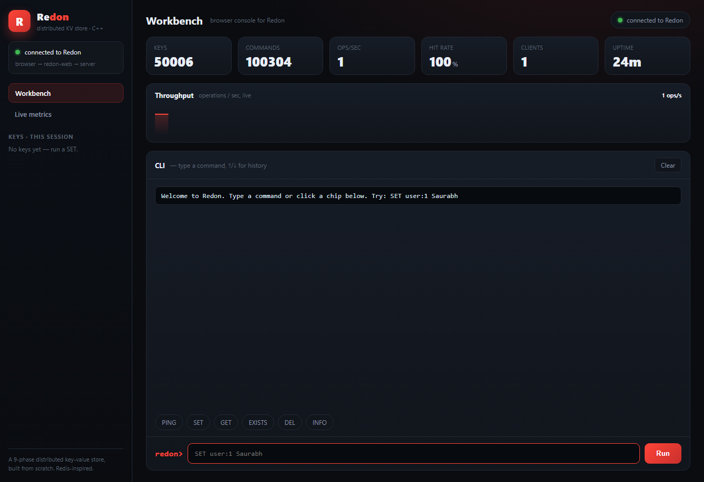

# Redon

A distributed key-value store I wrote from scratch in C++. No database, no
networking framework, no third-party libraries — just the standard library and raw
sockets.

`C++17` · raw sockets · thread pool · write-ahead log · LRU cache · replication ·
Raft leader election · sharding · on-disk LSM engine · Prometheus metrics · browser UI · **zero dependencies**

It started because I was tired of hand-waving about how systems like Redis and
etcd actually work, so I rebuilt their core ideas myself, one layer at a time, and
didn't let myself move on until I could run each one and explain it. The build goes
through nine stages, from "a socket that echoes bytes" to a sharded, replicated,
crash-safe store with its own leader election, an on-disk engine, and a dashboard.



It works, and it's tested: all 8 test suites pass under `ctest`, and the bundled
load generator pushes **~75,000 requests/second with zero errors** on my laptop
(50 connections, 100k operations, ~360µs average latency).

```
SET name Saurabh
GET name        ->  Saurabh
```

## Why I built it

I'd read about write-ahead logs, consensus, and LRU caches plenty of times. But
reading the Raft paper is not the same as watching three of your own processes
argue about who's in charge and then recover when you kill the winner. So I set one
rule: build each idea from the socket up, and write a plain-English explanation of
it before starting the next. Those explanations live in [`docs/`](docs/), one per
phase. It's a learning project, but I treated it like real code. Every phase went
through a hard review pass, and the bugs that surfaced (almost all of them on
failure paths, not the happy path) are fixed and written up below.

## The nine phases

| # | What it adds | The problem it solves | |
|--:|--------------|-----------------------|--|
| 1 | TCP server, `SET`/`GET`/`DEL`/`EXISTS`, in-memory store | talking to clients over a network | [docs](docs/PHASE1.md) |
| 2 | Thread pool | serving many clients at once | [docs](docs/PHASE2.md) |
| 3 | Write-ahead log | surviving a crash without losing data | [docs](docs/PHASE3.md) |
| 4 | LRU eviction | staying within a memory budget | [docs](docs/PHASE4.md) |
| 5 | Replication | surviving a whole machine dying | [docs](docs/PHASE5.md) |
| 6 | Raft leader election | agreeing who's in charge | [docs](docs/PHASE6.md) |
| 7 | Sharding | holding more data than one machine fits | [docs](docs/PHASE7.md) |
| 8 | On-disk storage engine | values beyond RAM, fast restart | [docs](docs/PHASE8.md) |
| 9 | Metrics / monitoring | seeing what the system is doing | [docs](docs/PHASE9.md) |

Every stage is a working program — you can build and use it after any phase, it
just does more each time.

## A quick tour of what's inside

The server handles many clients at once through a thread pool I wrote myself: a
bounded work queue with backpressure, plus idle and slow-client timeouts, because
the first version let one slow client tie up a worker forever (that bug bit me
early).

There are two ways to keep data. The default is a write-ahead log that's replayed
on startup, so a crash — even an abrupt kill — doesn't lose acknowledged writes.
The other is a log-structured, Bitcask-style on-disk engine that keeps values on
disk with only a key→offset index in memory, so the dataset can outgrow RAM.

For running across machines: a leader streams writes to read-only followers, with a
snapshot-then-live-stream cutover so a follower that reconnects doesn't miss or
double-apply anything. A cluster can also run **Raft leader election** (terms,
randomized timeouts, quorum voting, automatic failover) — that's election only, not
log replication yet; consensus on *who* leads, not yet on the data. Sharding spreads
keys across nodes through a routing proxy and a stable FNV-1a hash.

For seeing what it's doing, there are lock-free metric counters, an `INFO` command,
and a Prometheus `/metrics` endpoint Grafana can scrape. And if you'd rather not
live in a terminal, a small HTTP gateway serves the browser dashboard in the
screenshot above (no JS framework, no build step).

It's about 4,800 lines of C++ in the engine, 6,000 with the tests and load
generator.

## What I learned the hard way

The interesting bugs were almost never in the code that handles a correct request.
They were on the failure paths, and most only showed up when I went looking for
them. A few that stuck with me:

- A lock held across disk I/O. Taking a snapshot for a follower meant reading the
  whole dataset off disk while holding the one lock every request needs. Fine when
  I was poking at it with ten keys; with a real dataset it just froze. The fix was
  to grab the cheap index under the lock and read the actual values outside it,
  which is safe because the data file is append-only.
- A durability hole in eviction. When the cache evicted a key it logged the delete
  best-effort and dropped the key even if that log write failed, so a restart would
  replay the original `SET` and the "deleted" key would quietly come back.
- Parsers that didn't agree on a key. The router that hashes a key and the shard
  that stores it have to split the bytes the same way. A UTF-8 BOM on the first
  line, or locale-dependent whitespace, was enough to send a key to the wrong shard.
- Crash recovery that silently lost data. A truncated tail in the on-disk file
  could let later writes land after the corruption and vanish on the next restart.

Finding these is the part I'm most proud of. It's the difference between "works on
my machine" and something you'd actually trust.

## Get it running

> Options 1 and 4 (and building the zip yourself) compile from source, so they need
> **CMake 3.15+** and a **C++17 compiler** (Visual Studio 2022, or GCC/Clang) on
> your PATH. Running a prebuilt zip or the Docker image needs neither.

**1. The browser UI, one command.** Builds if needed, starts the server and the web
gateway, and opens the dashboard:

```sh
powershell -ExecutionPolicy Bypass -File scripts\run.ps1   # Windows
./scripts/run.sh                                            # Linux/macOS
```

Then open **http://127.0.0.1:8080**. Press Ctrl-C in that window to stop both.
There's more on the gateway in [docs/WEB.md](docs/WEB.md).

**2. Docker** (the only path that needs no compiler — just the Docker daemon
running):

```sh
docker build -t redon .
docker run --rm -p 8080:8080 -p 6380:6380 -p 9090:9090 redon
# open http://localhost:8080   (CLI on :6380, Prometheus metrics on :9090/metrics)
```

**3. A prebuilt Windows zip** (no toolchain needed to *run* it). Build the bundle:

```sh
powershell -ExecutionPolicy Bypass -File scripts\package.ps1
```

That produces `dist\redon-win64.zip`, holding all four executables, the docs, and a
`START-HERE.txt`. Unzip it anywhere and double-click `start.bat`. To stop it, end
`redon-server.exe` and `redon-web.exe` in Task Manager (closing the window doesn't
stop them). If you put the repo on GitHub, attach this zip to a Release so anyone
can download and run it.

**4. From source:**

```sh
cmake -S . -B build
cmake --build build --config Release
```

The executables land in `build/` (under `build/Release/` with Visual Studio).

## Using it from the terminal

Start the server in one terminal and the client in another (paths assume a Visual
Studio build; on Linux/macOS drop the `Release/`):

```sh
./build/Release/redon-server
./build/Release/redon-cli
```

```
Connected to Redon at 127.0.0.1:6380.
Type commands (SET/GET/DEL/EXISTS/PING), or QUIT to exit.
> SET name Saurabh
OK
> GET name
Saurabh
> DEL name
(integer) 1
> GET name
(nil)
> QUIT
OK
```

The default port is **6380** (Redis uses 6379; I bumped it by one so the two can
run side by side). The full command set:

| Command | Example | Reply |
|---------|---------|-------|
| `SET key value` | `SET name Saurabh` | `OK` |
| `GET key` | `GET name` | the value, or `(nil)` |
| `DEL key` | `DEL name` | `(integer) 1` |
| `EXISTS key` | `EXISTS name` | `(integer) 1` / `(integer) 0` |
| `PING` | `PING` | `PONG` |
| `INFO` | `INFO` | one line of live stats |
| `ROLE` | `ROLE` | `standalone (not a Raft cluster)`, or the node's role/term/leader in a cluster |
| `QUIT` | `QUIT` | `OK`, then closes the connection |

A value can contain spaces: `SET title Senior Software Engineer` stores the whole
phrase.

The server takes positional arguments and feature flags:

```sh
redon-server [host] [port] [threads] [wal] [idle-timeout] [lru-capacity] [flags]

redon-server 6380                                  # just a port; sensible defaults
redon-server 127.0.0.1 6380 8 none                 # in-memory (no WAL)
redon-server 127.0.0.1 6380 64 redon.wal 300 1000  # 64 workers, WAL, 300s idle, cap 1000 keys
```

`idle-timeout` is in seconds (`0` disables it, like Redis's `timeout`);
`lru-capacity` is the max key count (`0` = unbounded, like `maxmemory`).

## The distributed parts

Short tours; each linked doc explains the mechanics.

**Persistence** — every `SET`/`DEL` is appended to a write-ahead log and replayed
on startup, so data survives a crash. Pass `none` as the 4th argument to turn it
off. ([docs/PHASE3.md](docs/PHASE3.md))

**Replication** — a leader streams writes to read-only followers; a follower
rejects client writes and is caught up with a snapshot when it (re)connects.

```sh
redon-server 127.0.0.1 6381 8 none 0 0 --replica
redon-server 127.0.0.1 6380 8 redon.wal 300 0 --follower 127.0.0.1:6381
```
([docs/PHASE5.md](docs/PHASE5.md))

**Raft leader election** — give each node the others' addresses; the cluster elects
a leader and re-elects when it dies. Only the leader takes writes; the rest reply
`ERR NOTLEADER <addr>`. Run `ROLE` to see who's who, then kill the leader and watch.

```sh
redon-server 127.0.0.1 6510 4 none 0 0 --raft 127.0.0.1:6511 --raft 127.0.0.1:6512
redon-server 127.0.0.1 6511 4 none 0 0 --raft 127.0.0.1:6510 --raft 127.0.0.1:6512
redon-server 127.0.0.1 6512 4 none 0 0 --raft 127.0.0.1:6510 --raft 127.0.0.1:6511
```
([docs/PHASE6.md](docs/PHASE6.md))

**Sharding** — run a few plain servers as shards, then a router in front. The router
hashes each key to its owning shard; you only talk to the router.

```sh
redon-server 127.0.0.1 6701 4 none
redon-server 127.0.0.1 6702 4 none
redon-server 127.0.0.1 6700 4 none 0 0 --shard 127.0.0.1:6701 --shard 127.0.0.1:6702
```
([docs/PHASE7.md](docs/PHASE7.md))

**On-disk engine** — `--disk <path>` swaps the in-RAM map for a log-structured
engine that keeps values on disk with only an index in memory, so the dataset can
exceed memory and restarts stay fast.

```sh
redon-server 127.0.0.1 6380 4 none 0 0 --disk redon.db
```
([docs/PHASE8.md](docs/PHASE8.md))

**Metrics** — `--metrics-port <n>` serves Prometheus metrics; `INFO` gives the same
numbers in one line. The counters are lock-free atomics, so they don't slow the
request path.

```sh
redon-server 127.0.0.1 6380 4 none 0 0 --metrics-port 9090
curl http://127.0.0.1:9090/metrics    # or just open the URL in a browser
```
([docs/PHASE9.md](docs/PHASE9.md))

## Benchmarking

With a server running:

```sh
redon-bench 127.0.0.1 6380 50 1000   # 50 connections, 1000 SET+GET iterations each
```

It prints throughput and latency and exits non-zero if any reply came back wrong, so
I also use it to shake out concurrency bugs. On my laptop it does roughly 75k
requests/second across 50 connections with no errors; throughput scales with the
worker count up to about the core count.

## Tests

```sh
ctest --test-dir build -C Release
```

Eight suites cover the storage engine (including concurrent access), the protocol
parser, the thread pool, the write-ahead log's replay and torn-record recovery,
Raft voting, the shard router, the disk engine, and the metrics layer.

## How it's organized

```
src/
  net.h             cross-platform socket helpers (Winsock <-> POSIX)
  storage.*         storage front end: O(1) LRU cache, or the disk backend
  disk_store.*      log-structured on-disk engine (values off-heap)
  command.*         parse one protocol line and execute it
  thread_pool.*     worker pool: queue + mutex + condition_variable
  wal.*             write-ahead log: append + replay
  replication.*     leader-side streaming to followers
  raft.*            Raft leader election (terms, votes, quorum)
  router.*          sharding: hash a key, forward to its shard
  metrics.*         atomic counters, INFO, Prometheus endpoint
  server.*          accept loop, hands each client to the pool
  web.*             HTTP gateway + embedded browser dashboard
  main.cpp / web_main.cpp / client_main.cpp   the three entry points
bench/              concurrent load generator
tests/              8 suites, run with ctest
docs/               a plain-English walkthrough of every phase
scripts/            run + package helpers
Dockerfile          one-command build & run
```

## Honest limitations

It's a study project, and I'd rather be straight about the edges than oversell it:

- Raft does leader election, not log replication. Carrying writes through the Raft
  log is the natural next step.
- Sharding uses `hash(key) % N`, so changing the shard count reshuffles everything;
  consistent hashing would fix that. Each shard is also a single point of failure
  until it's replicated.
- Durability uses `flush()`, not `fsync()`: safe across a process crash, but a power
  cut can lose the last few writes.
- The web gateway and metrics endpoint are unauthenticated, so they bind to loopback
  by default. Put a reverse proxy with auth in front before exposing them.
- Metrics report mean latency; percentiles (p50/p99) would need histograms.

## What's next

If I keep going: Raft log replication on top of the election, consistent hashing for
the router, latency percentiles, and replicating each shard so it isn't a single
point of failure.

---

I'm Saurabh. I built Redon to actually understand how distributed databases work
instead of just reading about them — the [phase docs](docs/) walk through each piece
in order. Reach me on GitHub (`https://github.com/<your-username>`) or LinkedIn
(`https://linkedin.com/in/<your-handle>`).
